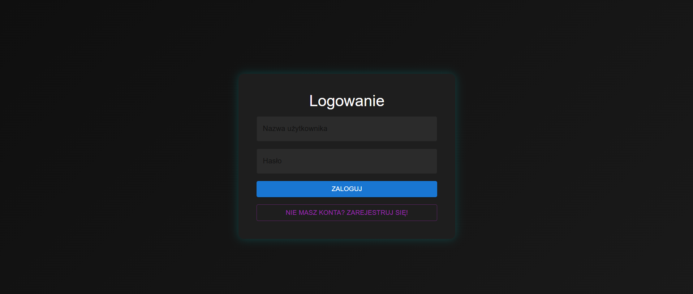

# iot-device-dashboard

Full-stack IoT monitoring platform.  
The **Node.js + Express** backend (TypeScript) persists environmental telemetry for up to 17 devices in MongoDB and exposes a JWT-secured REST API.  
The **React + Vite** frontend (TypeScript, Material-UI) handles authentication, renders a real-time dashboard and device health cards fed by `/api/data` endpoints.

---

## Technologies

| Layer      | Stack / Tools                                                |
|------------|--------------------------------------------------------------|
| Backend    | Node.js 18, Express 4, TypeScript, Mongoose, JWT, Nodemon    |
| Frontend   | React 18, Vite, TypeScript, Material-UI, React-Router        |
| Database   | MongoDB Atlas / local MongoDB instance                       |
| Dev Utils  | ts-node-dev / nodemon (hot reload), ESLint, Prettier         |

---

## Project structure

```text
iot-device-dashboard/
├── api/                      # backend
│   ├── lib/
│   │   ├── controllers/
│   │   ├── middlewares/
│   │   ├── modules/
│   │   └── services/
│   ├── public/               # static assets if any
│   ├── config.ts
│   ├── index.ts
│   ├── nodemon.json
│   ├── package.json
│   └── tsconfig.json
├── client/                   # frontend
│   ├── public/
│   ├── src/
│   │   ├── assets/
│   │   └── components/
│   ├── index.html
│   ├── vite-env.d.ts
│   ├── package.json
│   ├── tsconfig.json
│   └── vite.config.ts
│── screenshots/
└── README.md                 # <— you are here
```

## Screenshots

| Screen            | Preview |
|-------------------|---------|
| Login             |  |
| Registration      |  |
| Dashboard         |  |
| Admin panel       |  |

---

# Getting started

## 1 – Prerequisites
* Node.js ≥ 18 and npm ≥ 9
* Running MongoDB instance (local or Atlas)
* Two terminal windows (backend + frontend)

## 2 – Clone and install root dependencies

```
git clone https://github.com/piotrmol2002/iot-device-dashboard.git
cd iot-device-dashboard
npm install    # optional – only if you keep root-level dev tools
```

## 3 – Run the application

### Backend
```
cd api
npm install
npm run watch          # starts nodemon with ts-node
```
### Frontend (new terminal)
```
cd client
npm install
npm run dev            # Vite dev server → http://localhost:5173
```
Open http://localhost:5173

# System layers

## Frontend

* React SPA built with Vite.

* Stores the JWT in localStorage; protected routes redirect unauthenticated users.

* Dashboard.tsx fetches /api/data/latest and displays device cards plus live charts.

## Backend

* Express server bootstrapped in index.ts.

* Endpoints /api/data, /api/user, /api/auth protected by auth, role, admin, deviceIdParam middleware.

* nodemon + ts-node provide hot reload in development.

## Database

* **readings** collection (temperature, pressure, humidity, deviceId, readingDate).

* Connection and schema validation handled by Mongoose.


# Data Flow
```
┌──────────────┐      POST /api/data/:id          ┌──────────────┐
│  Device MCU  │ ────────────────────────────────▶│  Express API │
└──────────────┘                                   │  (Validate, │
        ▲                                          │   Persist)  │
        │                                          └─────┬───────┘
        │                                              │
        │                   MongoDB                    ▼
        │                                   ┌────────────────────┐
        │                                   │ readings collection│
        │                                   └───┬────────────────┘
        │                                       │
        │        GET /api/data/latest           ▼
┌──────────────┐ ◀──────────────────────────── ┌──────────────┐
│ React Client │ ←─ JWT header  x-auth-token ─ │  Express API │
└──────────────┘                               └──────────────┘
```

# Useful npm scripts

## api/package.json

| Script  | Purpose |
| ------------- |:-------------:|
| watch      | Start dev server via nodemon     |
| build      | Compile TypeScript to dist     |
| start      | Run compiled JS in production     |

## client/package.json

| Script  | Purpose |
| ------------- |:-------------:|
| dev      | Vite dev server     |
| build      | Production build     |
| preview      | Preview production     |

